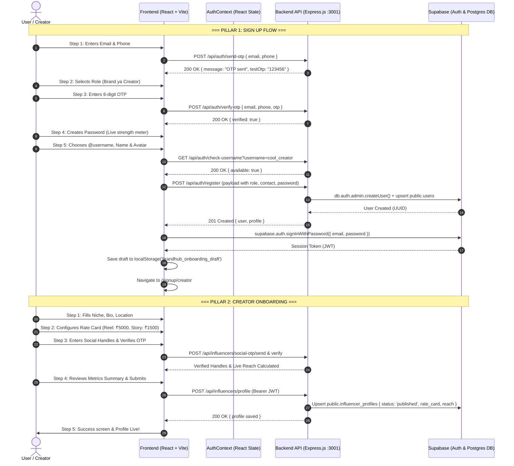

# 🚀 BrandHUB - Complete Sign In, Sign Up & Creator Onboarding Architecture

> **Language**: Hinglish (Hindi + English developer guide)  
> **Target Audience**: Developers & Product Team  
> **Last Updated**: October 2026  
> **File Locations**:
> - Frontend Login: `frontend/src/pages/auth/AuthPages.jsx`
> - Frontend Signup: `frontend/src/pages/auth/SignupPage.jsx`
> - Frontend Creator Onboarding: `frontend/src/pages/influencer/CreatorOnboardingPage.jsx`
> - Backend Auth Routes & Controller: `backend/src/routes/auth.routes.js`, `backend/src/controllers/auth.controller.js`
> - Backend Influencer Service: `backend/src/services/influencer.service.js`

---

## 📌 1. High-Level Overview (Bhai, Asal me ho kya raha hai?)

BrandHUB ka user acquisition aur onboarding system **3 main pillars** par khada hai:

```
[ 1. SIGN IN (Login) ] ───────┐
                              ▼
                       [ AuthContext ] ──▶ [ Role & Onboarding Checker ]
                              ▲                         │
[ 2. SIGN UP (5 Steps) ] ─────┤                         ├─▶ Incomplete? ──▶ [ 3. ONBOARDING ]
                              │                         │                     ├─ Brand Onboarding (/signup/brand)
[ Google OAuth / Portal ] ────┘                         │                     └─ Creator Onboarding (/signup/creator)
                                                        │
                                                        └─ Completed? ───▶ [ DASHBOARD (/dashboard) ]
```

1. **Sign In (`/login` ya `/auth/login`)**:
   - User chahe **Email** dale ya apna **@username**, system dynamically identify karta hai.
   - Supabase Auth session banata hai, user profile fetch hoti hai, aur check hota hai ki onboarding poori hui hai ya nahi.
2. **Sign Up (`/signup` ya `/auth/signup`)**:
   - 5-step interactive modern wizard hai.
   - Step 1 (Contact) ➔ Step 2 (Role: Brand vs Creator) ➔ Step 3 (Phone OTP Verification) ➔ Step 4 (Password Setup) ➔ Step 5 (Name, @username uniqueness check, Avatar).
   - Signup complete hote hi account backend + Supabase me register hota hai, auto-login hota hai, aur user seedha respective onboarding screen pe redirect ho jata hai.
3. **Creator Onboarding (`/signup/creator` ya `/onboarding/influencer`)**:
   - Ye 5 steps ka creator launchpad hai:
     - **Step 1**: Personal Info, Niche selection, Bio, Avatar.
     - **Step 2**: Rate Card & Deliverables (Reel, Post, Story, YouTube video rates, languages, portfolio).
     - **Step 3**: Social Accounts Connection & Live SMS OTP Verification (Instagram, YouTube, Snapchat, Facebook).
     - **Step 4**: Metrics Review & Confirmation (Total reach calculation, engagement review).
     - **Step 5**: Success Screen (Account verified, published status, redirect to profile/discovery).

---

## 🏛️ 2. System Architecture & Flowchart



---

## 🔑 3. Pillar 1: Sign In (Login) Flow Detail

### File: `frontend/src/pages/auth/AuthPages.jsx` (`LoginPage`)

#### Step-by-Step Execution:
1. **Identifier Resolution (Email vs Username)**:
   - User input field me apna **Email** bhi daal sakta hai (`rahul@gmail.com`) ya apna **Username** (`@rahul_vlogs`).
   - Frontend check karta hai: agar input me `@` nahi hai ya username jaisa format hai:
     ```js
     // Frontend calls backend to convert username to registered email:
     const { email } = await authService.resolveIdentifier(identifier.trim())
     ```
   - Backend `auth.service.js` ke andar `resolveIdentifier` function check karta hai:
     - `public.users` table me matching username/metadata search karta hai.
     - Email milne par response me real email return karta hai.
2. **Password Authentication via Supabase**:
   - Frontend Supabase client call karta hai:
     ```js
     const { data, error } = await supabase.auth.signInWithPassword({ email, password })
     ```
   - Agar password galat ho ya user block ho, error message UI pe display hota hai.
3. **Session & Profile Synchronization**:
   - Login hote hi `AuthContext` ka `onAuthStateChange` trigger hota hai.
   - Frontend turant `authService.me()` call karta hai:
     - Backend `getMe(auth)` user ki details fetch karta hai (`public.users`).
     - Agar user role `influencer` hai, to `influencer_profiles` check hota hai.
     - Agar profile me niche, reach ya profile image already hai, to `onboarding_completed = true` set hota hai.
     - Agar `brand` hai aur `business_name` already hai, to `onboarding_completed = true` set hota hai.
4. **Smart Redirection Engine (Kahan bhejna hai user ko?)**:
   ```js
   if (profile.role === 'admin') {
     navigate('/admin')
   } else if (!profile.role) {
     navigate('/role-select')
   } else if (profile.role === 'influencer' && !profile.onboarding_completed) {
     navigate('/signup/creator') // incomplete creator
   } else if (profile.role === 'brand' && !profile.onboarding_completed) {
     navigate('/signup/brand') // incomplete brand
   } else {
     navigate(fromLocation || '/dashboard') // Active & Ready
   }
   ```
5. **Google OAuth Login**:
   - User agar "Continue with Google" click karta hai, frontend call karta hai:
     ```
     window.location.href = 'http://localhost:3001/api/auth/google'
     ```
   - Google consent screen ke baad callback `GET /api/auth/google/callback` par aata hai.
   - Backend exchange karta hai auth code, user session set karta hai aur frontend redirect karta hai with auth tokens.

---

## 📝 4. Pillar 2: Sign Up (Registration) Flow Detail

### File: `frontend/src/pages/auth/SignupPage.jsx`

Sign up flow ko bilkul simple, distraction-free aur 5 linear steps me baanta gaya hai:

| Step | Screen Name | Kaam Kya Hota Hai? | Backend API / Action |
|:---:|:---|:---|:---|
| **1** | **Contact** | Email aur Phone number enter hota hai. Format validate hota hai. | `POST /api/auth/send-otp` |
| **2** | **Account Type** | User sirf 2 options me se chunta hai: **"As a Brand"** ya **"As a Creator"**. Saath me ek **"← Back"** button hota hai. Bilkul clean UI. | Frontend state update (`role: 'brand'` ya `'influencer'`) |
| **3** | **Verification** | User ke phone par bheja gaya 6-digit OTP manga jata hai. Real-time 60s countdown timer aur Resend OTP option. | `POST /api/auth/verify-otp` |
| **4** | **Security** | Password & Confirm Password input. Real-time strength meter (Weak / Fair / Good / Strong) + visual bar. | Frontend validation (min 6 chars, match check) |
| **5** | **Basic Profile** | Full Name, **Live @username availability check**, Country dropdown, Avatar selection / upload. | `GET /api/auth/check-username?username=...` |

### Step 5 Submit hone par kya hota hai? (Under the Hood)
Jab user Step 5 pe "Create Account & Continue" click karta hai:
1. **Backend Registration**:
   `POST /api/auth/register` call hota hai with complete payload:
   ```json
   {
     "email": "user@example.com",
     "password": "SecretPassword123",
     "name": "Aman Sharma",
     "username": "amansharma",
     "phone": "9876543210",
     "role": "influencer"
   }
   ```
2. **Backend Services (`auth.service.js`)**:
   - Supabase Auth admin API se user create hota hai (`email_confirm: true`).
   - `public.users` table me entry upsert hoti hai: `id`, `name`, `email`, `phone`, `role: 'influencer'`, `profile_status: 'active'`.
   - Temporary draft profile `public.influencer_profiles` me default placeholder ke saath save hoti hai.
3. **Auto Sign-In**:
   - Frontend bina user se dobara password mange turant Supabase `signInWithPassword` call karta hai.
4. **Draft Stored in LocalStorage**:
   - `localStorage.setItem('brandhub_onboarding_draft', JSON.stringify({ ...formData }))` save hota hai taaki onboarding step 1 pe user ko dobara apna naam aur username na likhna pade.
5. **Route Transition**:
   - Agar role `'influencer'` hai ➔ Navigate to `/signup/creator`.
   - Agar role `'brand'` hai ➔ Navigate to `/signup/brand`.

---

## 🌟 5. Pillar 3: Creator Onboarding Flow Detail

### File: `frontend/src/pages/influencer/CreatorOnboardingPage.jsx`

Jab creator sign up karke aata hai (ya login karta hai incomplete profile ke saath), wo is page par land hota hai.

```
┌─────────────────────────────────────────────────────────────────────────────┐
│                       CREATOR ONBOARDING (5 STEPS)                          │
├─────────────┬─────────────┬─────────────────┬─────────────┬─────────────────┤
│   Step 1    │   Step 2    │     Step 3      │   Step 4    │     Step 5      │
│ Creator Info│  Rate Card  │ Connect Socials │Review Metric│  Live Launch    │
│  (Profile)  │(Deliverables│ & SMS OTP Verify│& Summary Card│ (Congratulations│
└─────────────┴─────────────┴─────────────────┴─────────────┴─────────────────┘
```

### Detailed Breakdown of Every Step:

#### 🔹 Step 1: Creator Information
- **Fields**:
  - **Display Name**: User ka naam (pre-filled from draft).
  - **Primary Niche**: Single select chips/dropdown (e.g., *Fashion*, *Tech*, *Fitness*, *Travel*, *Food*, *Lifestyle*).
  - **Secondary Niches**: Multi-select tags (e.g., *Gadgets*, *AI*, *Unboxing*).
  - **Location / City**: Creator ka base location (e.g. *Mumbai*, *Delhi*, *Bangalore*).
  - **Bio**: Punchy 2-3 lines description.
  - **Profile Avatar**: Supabase Storage upload ya quick curated presets.
- **Save Action**: Step 1 complete hote hi local draft state sync hoti hai.

#### 🔹 Step 2: Rate Card & Deliverables
- Creator brands ko quote karne ke liye apne standard rates set karta hai:
  - **Instagram Reel**: Base rate (₹) (e.g. `₹5,000`)
  - **Static / Carousel Post**: Base rate (₹) (e.g. `₹2,500`)
  - **Instagram Story Set**: Base rate (₹) (e.g. `₹1,200`)
  - **YouTube Dedicated Video**: Base rate (₹) (e.g. `₹15,000`)
- **Languages**: Languages creator creates in (e.g. *Hindi, English, Punjabi*).
- **Portfolio Links**: Best performing reels/video URLs for brands to see.

#### 🔹 Step 3: Connect Social Accounts & Live Verification
- Creator apne real social channels connect karta hai:
  1. **Instagram**:
     - Handle enter karta hai (e.g. `@techwithaman`).
     - "Verify via OTP" click karta hai ➔ Backend mobile number pe OTP bhejta hai (`POST /api/influencers/social-otp/send`).
     - OTP verify hote hi **Green Verified Badge** mil jata hai aur followers count live fetch/simulate hota hai.
  2. **YouTube**:
     - Channel link paste karta hai.
     - Subscribers count verify hota hai.
  3. **Snapchat & Facebook**:
     - Optional handles connect karne ka option.
- **Combined Live Reach Engine**:
  - Jaise-jaise platforms connect hote hain, page real-time calculate karta hai:
    $$\text{Total Reach} = \text{Instagram Followers} + \text{YouTube Subscribers} + \text{Snapchat} + \text{Facebook}$$

#### 🔹 Step 4: Review Metrics & Confirmation
- Creator ko poora summary card dikhta hai:
  - Total verified audience count (e.g. `125,000+ Audience Reach`).
  - Estimated Engagement Rate (e.g. `4.8% Engagement`).
  - Rate Card Summary (Reel, Story, Post pricing breakdown).
  - Niches and Location preview.
- **Save Profile Submission**:
  - User "Publish Creator Profile" button click karta hai.
  - Frontend backend ko API hit karta hai:
    ```js
    await influencersService.saveProfile({
      name: formData.displayName,
      niche: formData.primaryNiche,
      followersCount: totalReach,
      engagementRate: calculatedEngagement,
      rateCard: {
        reel: formData.rateCard.reel,
        story: formData.rateCard.story,
        post: formData.rateCard.post,
        youtube: formData.rateCard.youtubeVideo,
        languages: formData.languages,
        socials: formData.socialAccounts
      },
      portfolioLinks: formData.portfolioLinks,
      location: formData.location,
      bio: formData.bio,
      profileImageUrl: formData.profileImage,
      status: 'published'
    })
    ```
  - Backend `influencer.service.js` is data ko `public.influencer_profiles` me `upsert` karta hai aur `public.users` me `name` sync karta hai.

#### 🔹 Step 5: Live Launch & Success!
- Confirmation Screen display hoti hai:
  - "🎉 Profile Published Successfully!"
  - Verified Creator badge and live status.
  - Buttons:
    - **"View Public Profile"** ➔ Navigates to `/creators/:id` (public view).
    - **"Go to Creator Dashboard"** ➔ Navigates to `/dashboard`.
  - `localStorage` se temporary draft clean ho jata hai.

---

## 🗄️ 6. Database Schema (Supabase Tables)

### 1. `auth.users` (Supabase Managed Table)
- `id` (UUID - Primary Key)
- `email` (Unique)
- `encrypted_password`
- `raw_user_meta_data` (JSON: `{ name, username, phone, role }`)

### 2. `public.users` (Application User Table)
- `id` (UUID, Foreign Key referencing `auth.users.id`)
- `name` (Text)
- `email` (Text, Unique)
- `phone` (Text)
- `role` ('influencer' | 'brand' | 'admin')
- `city` (Text)
- `pincode` (Text)
- `profile_status` ('active' | 'suspended')
- `created_at` (Timestamp)

### 3. `public.influencer_profiles` (Creator Details)
- `user_id` (UUID, Primary Key & Foreign Key referencing `users.id`)
- `niche` (Text, e.g. 'Tech')
- `followers_count` (Integer, e.g. 150000)
- `engagement_rate` (Numeric, e.g. 4.8)
- `bio` (Text)
- `location` (Text)
- `profile_image_url` (Text)
- `rate_card` (JSONB):
  ```json
  {
    "reel": 5000,
    "story": 1500,
    "post": 2500,
    "youtube": 15000,
    "languages": ["Hindi", "English"],
    "social_links": {
      "instagram": { "handle": "techwithaman", "verified": true, "followers": 85000 },
      "youtube": { "url": "https://youtube.com/@aman", "verified": true, "subscribers": 40000 }
    }
  }
  ```
- `portfolio_links` (Array of Text)
- `status` ('draft' | 'published')

---

## 🛡️ 7. Security & Protected Routes Architecture

Frontend routing me 3 layers ki protection lagi hui hai (`frontend/src/App.jsx` & `ProtectedRoute.jsx`):

1. **Guest Routes (`PublicLayout` & `AuthLayout`)**:
   - `/`, `/about`, `/contact`, `/login`, `/signup`
   - Koi bhi user access kar sakta hai.
2. **Authenticated Routes (`ProtectedRoute`)**:
   - User ka valid session hona zaroori hai (`user != null`).
   - Agar session nahi hai to seedha redirect to `/login`.
3. **Role Protected Routes (`RoleProtectedRoute`)**:
   - `/onboarding/creator` ➔ Sirf `influencer` role ko allow karta hai.
   - `/onboarding/brand` ➔ Sirf `brand` role ko allow karta hai.
   - `/admin/*` ➔ Sirf `admin` role ko allow karta hai.
4. **Backend Middleware (`backend/src/middleware/auth.middleware.js`)**:
   - Request header me `Authorization: Bearer <token>` check karta hai.
   - Token verify karke `req.auth = { id: user.id, email: user.email }` attach karta hai.
   - `allowRoles('influencer')` ensure karta hai ki koi brand account creator profile overwrite na kar sake.

---

## 🔍 8. Quick Troubleshooting Guide (Bhai agar kuch issue aaye to kya check karein?)

| Problem / Sawaal | Check Kahan Karna Hai? | Solution |
|:---|:---|:---|
| **User login karne ke baad bar-bar onboarding par kyu redirect ho raha hai?** | `backend/src/services/auth.service.js` (`getMe`) | Check karo ki `influencer_profiles` me `niche` ya `profile_image_url` ya `followers_count` save hua hai ya nahi. Agar ye empty hain to backend `onboarding_completed: false` bhejta hai. |
| **Username "Already Taken" bol raha hai signup me?** | `checkUsernameAvailability()` in `auth.service.js` | Username unique hona chahiye across all users aur reserved system words (jaise `admin`, `brandhub`) use nahi ho sakte. |
| **Sign up Step 3 pe phone OTP nahi aa raha?** | `backend/src/services/auth.service.js` (`sendRegistrationOtp`) | Development mode me backend console log me test OTP print karta hai (default: `123456`). |
| **Creator ke social metrics add nahi ho rahe?** | `influencer.service.js` (`save`) | Ensure karo ki user logged in hai aur uske token me `role: 'influencer'` set hai. |

---

## 🏁 Summary Checklist
- [x] **Sign In**: Email ya Username dono support karta hai + auto role routing.
- [x] **Sign Up**: 5-step clean wizard + phone OTP + live username check.
- [x] **Creator Onboarding**: 5 steps + rate card + live reach calculation + final profile publish.
- [x] **Data Persistence**: Supabase Auth + `public.users` + `public.influencer_profiles`.
