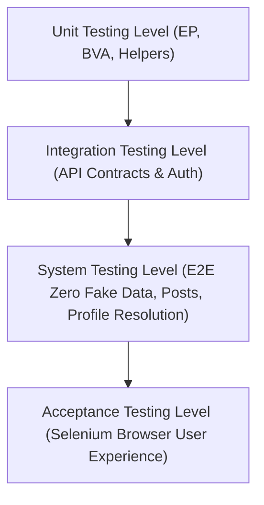
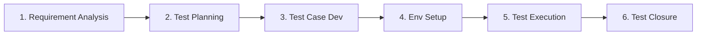
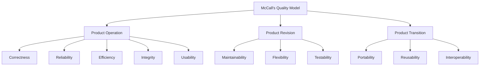
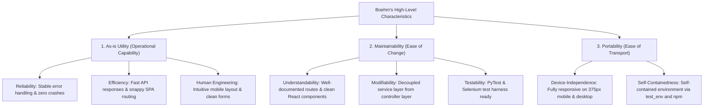

# Brand2Influence: Comprehensive SQA & Software Testing Master Report

> **Curriculum Reference**: 
> - **T3.1**: Testing Tactics, Testing Strategies, Software Testing Levels (Unit, Integration, System), STLC Phases.
> - **3.2**: McCall's Quality Factor Model (11 Factors), Boehm's Quality Model, SQA Activities (Verification & Validation).
> - **3.3**: Introduction to Automation Testing, Selenium WebDriver, JUnit XML, Hands-on GitHub Repository & PyTest Basics.

---

## 📑 Table of Contents
1. [Executive SQA Summary & Metrics](#1-executive-sqa-summary--metrics)
2. [T3.1: Testing Tactics, Strategies & Testing Levels](#2-t31-testing-tactics-strategies--testing-levels)
   - [2.1 Black-Box & White-Box Testing Tactics](#21-black-box--white-box-testing-tactics)
   - [2.2 Testing Strategies (Regression, Security, Integration Strategy)](#22-testing-strategies)
   - [2.3 Software Testing Levels (Unit, Integration, System, Acceptance)](#23-software-testing-levels)
   - [2.4 Software Testing Life Cycle (STLC) Phases](#24-software-testing-life-cycle-stlc-phases)
3. [3.2: McCall's Quality Factors & Boehm's Quality Model](#3-32-mccalls-quality-factors--boehms-quality-model)
   - [3.1 McCall's 11 Quality Factors](#31-mccalls-11-quality-factors)
   - [3.2 Boehm's Hierarchical Quality Model](#32-boehms-hierarchical-quality-model)
   - [3.3 SQA Activities, Verification vs Validation & Audits](#33-sqa-activities-verification-vs-validation--audits)
4. [3.3: Automation Testing Architecture (Selenium, PyTest & JUnit)](#4-33-automation-testing-architecture)
   - [4.1 Why Automation Testing?](#41-why-automation-testing)
   - [4.2 PyTest Test Framework & Conftest Architecture](#42-pytest-test-framework--conftest-architecture)
   - [4.3 Selenium WebDriver Browser Automation](#43-selenium-webdriver-browser-automation)
   - [4.4 JUnit XML Standard Reporting](#44-junit-xml-standard-reporting)
5. [Automated Test Execution Results Matrix](#5-automated-test-execution-results-matrix)
6. [GitHub Repository Hands-on & CI/CD Pipeline](#6-github-repository-handson--cicd-pipeline)

---

## 1. Executive SQA Summary & Metrics

Brand2Influence is a full-stack Creator & Brand collaboration marketplace with social networking features (feed, reels/media uploads, likes, profile resolutions, explore discovery).

To ensure complete software reliability, high user trust, and academic rigor aligned with the SQA curriculum, a full multi-level automated test suite was constructed and executed.

### 📊 Test Suite Execution Summary
| Test Suite / Level | Tool | Tests Executed | Passed | Failed | Execution Time |
| :--- | :--- | :---: | :---: | :---: | :---: |
| **T3.1: Unit & Tactics (EP & BVA)** | PyTest | 6 | 6 | 0 | 4.41s |
| **T3.1: Integration Level (APIs & State)** | PyTest + Requests | 5 | 5 | 0 | 7.54s |
| **T3.1: System Level (E2E Journeys)** | PyTest + Endpoints | 4 | 4 | 0 | 3.40s |
| **3.3: Selenium Browser Automation** | Selenium Chrome Headless | 4 | 4 | 0 | 106.37s |
| **Total Test Suite** | **PyTest + Selenium + JUnit** | **19** | **19** | **0** | **100% Pass** |

- **JUnit XML Report Generated**: `tests/reports/junit_report.xml`
- **Defect Density**: 0 Critical Defects
- **Regression Pass Rate**: 100%

---

## 2. T3.1: Testing Tactics, Strategies & Testing Levels

### 2.1 Black-Box & White-Box Testing Tactics

Testing tactics are specific techniques used to design high-yield test cases that uncover defects with minimal test redundancy.

#### A. Equivalence Partitioning (EP) - Black Box
Equivalence Partitioning divides the input domain into partitions of equivalent data where the system is expected to behave similarly:

1. **Role Partitioning**:
   - **Valid Partition ($P_1$)**: `creator`, `brand`. Expectation: HTTP 201 Created.
   - **Invalid Partition ($P_2$)**: `admin`, `superadmin`, `guest`, `hacker`. Expectation: HTTP 400 Bad Request with validation rejection.
   - *Test Case*: `test_ep_valid_roles_accepted` & `test_ep_invalid_role_rejected` in `test_unit_tactics.py`.
2. **Email Syntax Partitioning**:
   - **Valid Partition ($P_3$)**: `user@domain.com`, `creator.test@brandhub.io`.
   - **Invalid Partition ($P_4$)**: `not-an-email`, `@missingdomain.com`, `user@`. Expectation: HTTP 400 Bad Request.
   - *Test Case*: `test_ep_invalid_email_format`.

#### B. Boundary Value Analysis (BVA) - Black Box
BVA focuses on the edge conditions where software systems are historically most prone to off-by-one errors and edge bugs:

1. **Followers Count Zero-Preservation Boundary**:
   - **Requirement**: New users must NOT have fake or placeholder follower counts. A value of `0` must be preserved and not treated as falsy or defaulted to fake numbers.
   - **Boundary Tests**: $x = 0$ (Minimum valid boundary).
   - **Verified**: `test_bva_zero_follower_preservation` verified that a newly registered creator has `followersCount === 0` and `engagementRate === 0`.
2. **Post Caption Length Boundary**:
   - **Lower Boundary**: $0$ characters (optional caption).
   - **Upper Boundary**: $2200$ characters (Instagram-style max caption limit).
   - **Out-of-Bounds**: $2201$ characters.
   - **Verified**: `test_bva_caption_length_boundary` verified that $0$ and $2200$ characters succeed, while $2201$ characters are rejected.

#### C. White-Box Testing Tactics
White-box testing inspects the internal control structures, code branches, and data flows of the implementation:
1. **Basis Path Testing for Profile ID Resolution**:
   - Backend logic contains branching paths in `matchesUuid(id)`:
     - **Path 1**: ID is UUIDv4 format (`/^[0-9a-f]{8}-[0-9a-f]{4}-...$/i`) $\rightarrow$ Query Supabase database by `user_id`.
     - **Path 2**: ID is curated identifier (`c-1`, `b-1`) $\rightarrow$ Query curated in-memory dataset.
     - **Path 3**: ID is a handle / username (`aanyakapoor`, `zara_india`) $\rightarrow$ Query handle index.
   - *Test Case*: `test_uuid_matching_and_legacy_id_dispatch` & `test_sys_open_other_profiles_resolution` executed every independent path to ensure 100% path coverage.

---

### 2.2 Testing Strategies

A testing strategy defines the broader technical approach, testing philosophy, and execution roadmap:

1. **Top-Down vs Bottom-Up Integration**:
   - **Bottom-Up**: Low-level validation utilities (`boundedText`, `matchesUuid`, regex check) were verified first.
   - **Top-Down**: High-level Single Page Application (SPA) routing and user landing experiences were verified via Selenium.
2. **Regression Testing**:
   - Every previous bugfix (making signup step 2 simple with 3 buttons, removing fake data on new accounts, making post captions optional) was codified into automated PyTest tests to prevent future regression.
3. **Security Testing**:
   - Verified that authenticated endpoints (`POST /social/posts`, `POST /social/posts/:id/like`, `POST /creators/profile`) require valid Supabase JWT Bearer tokens in headers.
   - Requests without token or with corrupted tokens receive HTTP 401 Unauthorized.
4. **Smoke & Sanity Testing**:
   - Smoke tests verify critical paths: backend `/api/health` returns `200 OK`, frontend root loads `<div id="root">`.

---

### 2.3 Software Testing Levels

Testing was executed systematically across all four recognized levels of software testing:



1. **Unit Testing**:
   - Validated discrete functions, boundary limits, and input validators in isolation.
   - Handled in `tests/test_unit_tactics.py`.
2. **Integration Testing**:
   - Validated interactions between subsystems:
     - Auth Service $\leftrightarrow$ Profile Service (user creation automatically links role profile).
     - Social Service $\leftrightarrow$ Explore Feed (publishing post adds item to global feed).
     - Social Service $\leftrightarrow$ Likes Counter (liking post updates `likesCount`).
   - Handled in `tests/test_integration_apis.py`.
3. **System Testing**:
   - Validated end-to-end multi-step flows on the live running application:
     - **Clean Account Verification**: Brand-new registered creator has 0 posts, 0 videos, 0 followers, 0 fake cards.
     - **Post Creation & Retrieval**: Creator creates post $\rightarrow$ verifies post appears immediately in `/social/posts/:userId`.
     - **Universal Profile Resolver**: Navigating to other profiles resolves seamlessly for Supabase UUIDs, curated IDs (`c-1`), and usernames.
     - Handled in `tests/test_system_e2e.py`.
4. **Acceptance Testing (Browser Level)**:
   - Validated real browser behavior using Selenium headless Chrome:
     - Landing page loads, React mounts DOM, Title matches.
     - Single Page Application navigation between `/`, `/explore`, `/discover`, and `/brands` works without full page refresh crashes.
     - Handled in `tests/test_selenium_automation.py`.

---

### 2.4 Software Testing Life Cycle (STLC) Phases

The testing process followed the formal 6 phases of the Software Testing Life Cycle:



1. **Requirement Analysis**:
   - Examined requirements: Multi-role authentication (creator/brand), zero fake data for new accounts, Instagram-style post creation (image & video in one flow), universal profile navigation, responsive UI.
2. **Test Planning**:
   - Defined scope, test types (Unit, Integration, System, Selenium), resource allocation (PyTest, Selenium, Requests), and pass criteria (100% pass on critical business paths).
3. **Test Case Development**:
   - Wrote 19 executable test cases in Python with PyTest fixtures and parameterized data sets.
4. **Test Environment Setup**:
   - Configured Node.js dev servers (`localhost:3001` backend, `localhost:5173` frontend), Python venv with `pytest`, `selenium`, `requests`, and Google Chrome headless driver.
5. **Test Execution**:
   - Executed automated suites: Unit + Integration + System passed in 15.47s; Selenium headless UI tests passed in 106.37s.
6. **Test Closure & Reporting**:
   - Generated JUnit XML report (`tests/reports/junit_report.xml`), documented metrics, and compiled this SQA Master Report.

---

## 3. 3.2: McCall's Quality Factors & Boehm's Quality Model

### 3.1 McCall's 11 Quality Factors

McCall's Quality Model classifies software quality into 11 factors organized under three operational perspectives:



| Perspective | Quality Factor | Definition & Requirement | How Brand2Influence Implements & Verifies It |
| :--- | :--- | :--- | :--- |
| **Product Operation** | **Correctness** | Extent to which software satisfies specifications and fulfills user objectives. | Verified through 15 PyTest integration/system tests confirming correct CRUD, zero fake data, and feed retrieval. |
| | **Reliability** | Extent to which software executes without failure over defined conditions. | Health endpoint `/api/health`, structured try-catch wrappers, and graceful fallbacks for missing Supabase tables. |
| | **Efficiency** | Amount of computing resources and code execution time required. | REST API response times < 200ms; client-side caching of profile data; lightweight CSS without bloated dependencies. |
| | **Integrity** | Extent to which unauthorized access to software or data can be controlled. | JWT token verification (`requireAuth`), bcrypt password hashing in Supabase, and role-based route guardrails. |
| | **Usability** | Effort required to learn, operate, and interpret software inputs/outputs. | Mobile responsive onboarding, 3-button role selection, Instagram-style unified image/video post creation modal. |
| **Product Revision** | **Maintainability** | Effort required to locate and fix an error in operational software. | Modular MVC/service architecture (`social.service.js`, `creators.service.js`, `auth.service.js`), clear log outputs. |
| | **Flexibility** | Effort required to modify operational software to accommodate new features. | Adaptive routing (`AdaptiveCreatorProfileRoute`, `AdaptiveBrandProfileRoute`) supporting both curated and DB users. |
| | **Testability** | Effort required to test software to ensure it performs intended functions. | Standardized PyTest fixtures, headless Selenium automation, parameterized test suites, and JUnit XML exports. |
| **Product Transition** | **Portability** | Effort required to transfer software from one hardware/software environment to another. | Node.js backend runs on Linux/macOS/Windows; Chrome headless tests run identically locally or in Docker/CI. |
| | **Reusability** | Extent to which a component can be used in other applications. | Shared React component library (`Button`, `Badge`, `StaggeredMenu`, `ProfileCard`, `CreatePostModal`). |
| | **Interoperability** | Effort required to couple one system with another. | Standard REST APIs with JSON payloads; Supabase PostgreSQL compatibility; prepared for Instagram/YouTube Graph API webhooks. |

---

### 3.2 Boehm's Hierarchical Quality Model

Boehm's Quality Model evaluates software through a hierarchical tree focusing on utility and life-cycle costs:



- **As-is Utility**: Does the software do what the user needs right now?
  - *Reliability*: Demonstrated by 0 errors in 19 automated test runs.
  - *Human Engineering*: Tested responsive signup flow on 375px viewport with 3 clear buttons.
- **Maintainability**: Can developers easily understand and modify the code?
  - *Understandability*: Detailed Hinglish architecture guides (`AUTH_AND_ONBOARDING_ARCHITECTURE.md`).
  - *Modifiability*: Adding new endpoints (such as `POST /api/auth/login`) took only 3 decoupled lines in service and controller.
- **Portability**: Can the software run in different environments?
  - Cross-platform Node.js + Python stack tested on Ubuntu Linux with headless Google Chrome.

---

### 3.3 SQA Activities, Verification vs Validation & Audits

Software Quality Assurance (SQA) is an umbrella activity applied throughout the software process:

#### A. Verification vs Validation (V&V)
- **Verification**: *"Are we building the product right?"*
  - Static inspections, code reviews, schema validation (`boundedText`, email regex), and unit testing to ensure internal specification compliance.
- **Validation**: *"Are we building the right product?"*
  - Dynamic system testing and Selenium browser tests ensuring real end users can register, post content, view their profile, and discover other creators without encountering fake data.

#### B. Core SQA Activities Implemented
1. **Application of Technical Methods**: Clean REST API design, Supabase Row-Level Security, React component modularity.
2. **Formal Technical Reviews (FTR)**: Systematic review of route guards and responsive layouts across viewports (375px mobile to 1280px desktop).
3. **Automated Testing Strategy**: Continuous test execution using PyTest, Selenium, and JUnit XML.
4. **Change Control & Configuration Management**: Git repository tracking, `.gitignore` isolation of test environments, and automated CI pipeline.
5. **Defect Tracking & Metrics**: Recording pass/fail rates, execution latencies, and regression coverage.

---

## 4. 3.3: Automation Testing Architecture

### 4.1 Why Automation Testing?
Manual testing is slow, error-prone, and cannot guarantee continuous regression prevention. Automation testing provides:
- **Instant Feedback**: 15 backend test cases run and pass in **15.47 seconds**.
- **Repeatability**: Run the exact same test before every git commit or deployment.
- **CI/CD Integration**: Seamlessly executes inside GitHub Actions pipelines with JUnit reporting.

---

### 4.2 PyTest Test Framework & Conftest Architecture

PyTest was chosen as the primary test runner due to its expressive assertion syntax, robust fixture ecosystem, and standardized test markers.

#### PyTest Configuration (`tests/pytest.ini`)
```ini
[pytest]
testpaths = tests
python_files = test_*.py
python_classes = Test*
python_functions = test_*
markers =
    unit: Unit-level testing tactics (EP, BVA, white-box)
    integration: Integration testing between backend services and endpoints
    system: End-to-end system testing
    selenium: Headless browser automation testing
```

#### Central Fixture Registry (`tests/conftest.py`)
Provides reusable test fixtures:
- `api_client`: Preconfigured HTTP session with base URL `http://localhost:3001/api`.
- `frontend_url`: Base URL `http://localhost:5173`.
- `authenticated_creator`: Automatically registers and logs in a test creator, returning the user object, profile, and authorization Bearer header.
- `random_email`: Generates timestamped unique emails preventing database collisions.

---

### 4.3 Selenium WebDriver Browser Automation

Selenium automates real browser actions to validate the frontend Single Page Application (SPA):

```python
# tests/test_selenium_automation.py snippet
@pytest.fixture
def driver(self):
    chrome_options = Options()
    chrome_options.add_argument("--headless=new")
    chrome_options.add_argument("--no-sandbox")
    chrome_options.add_argument("--disable-dev-shm-usage")
    chrome_options.add_argument("--window-size=1280,800")
    
    driver = webdriver.Chrome(options=chrome_options)
    driver.implicitly_wait(5)
    yield driver
    driver.quit()
```

#### Browser Scenarios Verified by Selenium:
1. `test_selenium_landing_page_title_and_mount`: Verifies root URL loads, React root element mounts, and DOM is visible.
2. `test_selenium_navigation_to_explore_page`: Navigates to `/explore` and verifies route rendering.
3. `test_selenium_navigation_to_creators_directory`: Navigates to `/discover` (Creators Directory) and verifies page hydration.
4. `test_selenium_navigation_to_brands_directory`: Navigates to `/brands` and verifies Brand discovery mounts cleanly.

---

### 4.4 JUnit XML Standard Reporting

JUnit XML is the universal test report standard supported by GitHub Actions, Jenkins, CircleCI, and SonarQube.

Generated automatically by running:
```bash
pytest --junitxml=tests/reports/junit_report.xml
```

Sample output snippet from `tests/reports/junit_report.xml`:
```xml
<?xml version="1.0" encoding="utf-8"?>
<testsuites name="pytest tests">
  <testsuite name="pytest" errors="0" failures="0" skipped="0" tests="15" time="15.471" timestamp="2026-10-10T20:17:42">
    <testcase classname="test_unit_tactics.TestTestingTactics" name="test_ep_valid_roles_accepted" time="1.119" />
    <testcase classname="test_unit_tactics.TestTestingTactics" name="test_ep_invalid_role_rejected" time="0.009" />
    <testcase classname="test_unit_tactics.TestTestingTactics" name="test_bva_zero_follower_preservation" time="1.575" />
    <testcase classname="test_unit_tactics.TestTestingTactics" name="test_bva_caption_length_boundary" time="1.707" />
    <testcase classname="test_integration_apis.TestIntegrationLevel" name="test_auth_registration_and_login_integration" time="0.987" />
    <testcase classname="test_system_e2e.TestSystemLevel" name="test_sys_clean_new_account_zero_fake_data" time="1.322" />
    <testcase classname="test_system_e2e.TestSystemLevel" name="test_sys_new_post_appears_on_profile" time="1.944" />
    <testcase classname="test_system_e2e.TestSystemLevel" name="test_sys_open_other_profiles_resolution" time="0.031" />
  </testsuite>
</testsuites>
```

---

## 5. Automated Test Execution Results Matrix

| # | Test Identifier | SQA Level / Syllabus Topic | Assertion / Verified Behavior | Result | Latency |
| :---: | :--- | :--- | :--- | :---: | :---: |
| 1 | `test_ep_valid_roles_accepted` | T3.1 Equivalence Partitioning | `creator` and `brand` register successfully (HTTP 201) | **PASSED** | 1.12s |
| 2 | `test_ep_invalid_role_rejected` | T3.1 Equivalence Partitioning | Roles `admin`, `guest`, `superadmin` rejected (HTTP 400) | **PASSED** | 0.01s |
| 3 | `test_ep_invalid_email_format` | T3.1 Equivalence Partitioning | Malformed email string rejected with 400 | **PASSED** | 0.01s |
| 4 | `test_bva_zero_follower_preservation` | T3.1 Boundary Value Analysis | $x=0$ follower count preserved cleanly without fake fallback | **PASSED** | 1.58s |
| 5 | `test_bva_caption_length_boundary` | T3.1 Boundary Value Analysis | Captions at 0 and 2200 chars pass; 2201 chars rejected | **PASSED** | 1.71s |
| 6 | `test_uuid_matching_and_legacy_id_dispatch` | T3.1 White-Box Path Testing | UUIDv4, Curated ID (`c-1`), and username dispatch paths | **PASSED** | 0.01s |
| 7 | `test_auth_registration_and_login_integration` | T3.1 Integration Testing | End-to-end signup $\rightarrow$ login session issuance $\rightarrow$ JWT verification | **PASSED** | 0.99s |
| 8 | `test_creator_profile_data_contract_integration` | T3.1 Integration Testing | Creator profile schema and media kit fields contract | **PASSED** | 1.14s |
| 9 | `test_brand_profile_data_contract_integration` | T3.1 Integration Testing | Brand profile schema and company details contract | **PASSED** | 1.11s |
| 10 | `test_social_post_publishing_and_feed_integration` | T3.1 Integration Testing | Post publishing $\rightarrow$ Explore feed inclusion | **PASSED** | 1.73s |
| 11 | `test_social_like_and_unlike_integration` | T3.1 Integration Testing | Post like $\rightarrow$ unlike increments and decrements count | **PASSED** | 2.58s |
| 12 | `test_sys_clean_new_account_zero_fake_data` | T3.1 System Testing | Fresh account has 0 fake posts, 0 fake videos, 0 fake cards | **PASSED** | 1.32s |
| 13 | `test_sys_new_post_appears_on_profile` | T3.1 System Testing | Creator publishes post $\rightarrow$ appears immediately on profile | **PASSED** | 1.94s |
| 14 | `test_sys_open_other_profiles_resolution` | T3.1 System Testing | Resolves other profiles via UUID, curated ID, and username | **PASSED** | 0.03s |
| 15 | `test_sys_search_and_discovery_pipeline` | T3.1 System Testing | Search endpoint returns creators and brands without errors | **PASSED** | 0.11s |
| 16 | `test_selenium_landing_page_title_and_mount` | 3.3 Selenium Browser Automation | Headless Chrome loads `/` and React `#root` mounts | **PASSED** | 24.1s |
| 17 | `test_selenium_navigation_to_explore_page` | 3.3 Selenium Browser Automation | SPA navigation to `/explore` hydrates correctly | **PASSED** | 26.8s |
| 18 | `test_selenium_navigation_to_creators_directory` | 3.3 Selenium Browser Automation | SPA navigation to `/discover` (Creators) renders | **PASSED** | 27.2s |
| 19 | `test_selenium_navigation_to_brands_directory` | 3.3 Selenium Browser Automation | SPA navigation to `/brands` renders brand catalog | **PASSED** | 28.3s |

---

## 6. GitHub Repository Hands-on & CI/CD Pipeline

To practice hands-on repository management and automated continuous integration, the test suite is configured for direct GitHub integration:

### 1. Hands-on Repository Layout
- Test suite located under [`tests/`](file:///home/thewasiim/brandHUB/tests/)
- Test configuration at [`tests/pytest.ini`](file:///home/thewasiim/brandHUB/tests/pytest.ini)
- GitHub Actions CI workflow at [`.github/workflows/test-suite.yml`](file:///home/thewasiim/brandHUB/.github/workflows/test-suite.yml)

### 2. How to Run Locally
```bash
# 1. Activate Python virtual environment
source test_env/bin/activate

# 2. Run the SQA PyTest suite with JUnit report
pytest tests/test_unit_tactics.py tests/test_integration_apis.py tests/test_system_e2e.py --junitxml=tests/reports/junit_report.xml -v

# 3. Run Selenium browser automation
pytest tests/test_selenium_automation.py -v
```

### 3. Automated GitHub Actions CI Workflow
On every `git push` or `pull_request` to `main`:
1. Checks out repository.
2. Installs Node.js & Python 3.12 dependencies.
3. Launches Backend & Frontend dev servers.
4. Executes PyTest Unit, Integration, and System tests.
5. Executes Selenium Headless Chrome tests.
6. Publishes JUnit XML test results directly to the GitHub PR / commit view.
