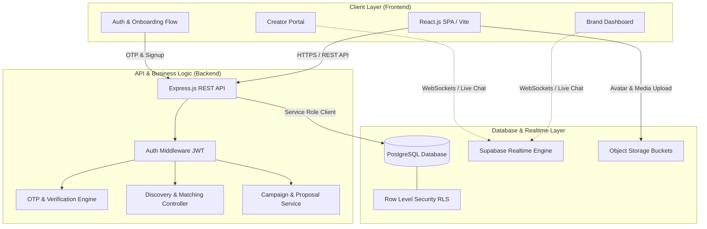

# Technical Proposal: Brand2Influence (BrandHUB)
### Next-Generation Influencer & Brand Collaboration Platform

---

## 1. Title
**Brand2Influence (BrandHUB)** — An AI-Ready, Two-Sided Marketplace & Collaboration Platform for Brands and Micro/Nano Creators.

---

## 2. Introduction
**Brand2Influence** is a full-stack, two-sided web platform designed to bridge the gap between emerging direct-to-consumer (D2C) brands, local businesses, and micro/nano content creators. 

### Purpose & Vision
Traditional influencer marketing is dominated by high-cost talent agencies and celebrity-tier endorsements, leaving small-to-medium businesses (SMBs) and micro-creators (1K–100K followers) with an inefficient, fragmented ecosystem. Brand2Influence democratizes influencer marketing by offering:
- A centralized marketplace where brands can discover verified creators tailored to their budget, niche, and location.
- An editorial, Instagram-inspired portal where creators can showcase verified audience reach, portfolio deliverables, and standardized rate cards.
- Frictionless end-to-end collaboration—from discovery and real-time negotiations to campaign tracking.

---

## 3. Problem Statement
Despite the rapid growth of the creator economy, collaboration between local businesses and emerging creators suffers from critical bottlenecks:

1. **Fragmented & Inefficient Discovery:**
   - Brands waste dozens of hours searching Instagram, TikTok, and YouTube manually, relying on cold direct messages (DMs) that often land in "Message Requests" or get ignored.
2. **Lack of Price & Metric Transparency:**
   - Micro-influencers do not have standardized rate cards or professional media kits. Pricing is arbitrary, and brands often overpay or hesitate due to uncertainty.
3. **The Micro-Influencer Visibility Gap:**
   - High-engagement nano/micro-influencers (1K–50K followers) struggle to monetize their content or secure brand deals due to a lack of agency representation.
4. **Security & Credibility Risks:**
   - Prevalent fake follower fraud, ghosting after payment, unverified social metrics, and sharing sensitive personal contact details (phone numbers, personal emails) publicly on social bios.

---

## 4. Objectives
The key objectives of building Brand2Influence are:

1. **Seamless Role-Based Onboarding:**
   - Deliver an intuitive 5-step registration flow with instant OTP verification (Email/SMS), role assignment (**Brand** vs. **Creator**), and real-time handle availability checks.
2. **Standardized Creator Media Kits & Live Reach:**
   - Enable creators to connect multi-platform handles (Instagram, YouTube, TikTok) and display aggregated real-time reach metrics and transparent deliverables rate cards (e.g., Reel, Story, Dedicated Video).
3. **Intelligent Search & Filter Discovery Engine:**
   - Allow brands to filter creators by category/niche (Fashion, Tech, Food, Fitness), geographic location, follower tier, engagement rate, and budget range with sub-500ms latency.
4. **Direct In-App Communication:**
   - Eliminate cold DMs by providing an integrated 1:1 real-time messaging environment with media sharing and proposal tracking.
5. **Campaign Lifecycle Management:**
   - Enable brands to post specific campaign briefs (e.g., "Cafe Launch, ₹5,000 budget, Food Bloggers in Pune") and creators to apply directly with custom pitches.
6. **Mobile-First Responsive Luxury UX:**
   - Implement an aesthetic CodeAstra Obsidian Luxury design system (`#0B0B0A` obsidian, `#F4F1E8` warm cream, `#0047AB` cobalt blue) that is responsive across mobile, tablet, and desktop viewports.

---

## 5. Proposed Solution
Brand2Influence resolves these market challenges through a purpose-built, secure platform architecture:

| Challenge | How Brand2Influence Solves It |
|---|---|
| **Cold Outreach & High Drop-Off** | Direct in-app communication pipeline and structured campaign applications. |
| **Opaque Pricing** | Dynamic rate cards built into creator profiles (Per Post, Reel, Story, Bundle). |
| **Fake or Inflated Metrics** | Phone/SMS verified social integration with live aggregate reach calculation. |
| **Cluttered User Experience** | Instagram-inspired 5-step onboarding flow with role separation and progressive disclosure. |
| **Privacy Concerns** | Zero public leakage of personal phone/email; identity protection until collaboration consent. |

### Core Feature Modules:
1. **Authentication & Multi-Step Onboarding:**
   - **Step 1:** Contact credentials (Email & Phone) with background OTP trigger.
   - **Step 2:** Explicit Account Type selection (**Brand** vs. **Creator**).
   - **Step 3:** 6-digit OTP security verification with automated countdown and resend.
   - **Step 4:** Strong password creation with real-time entropy calculation.
   - **Step 5:** Profile completion (Avatar upload, unique `@username` validation, country selector).
2. **Brand Suite:**
   - Company profile configuration, campaign creation wizard, creator discovery board, proposal reviewer, and direct messaging.
3. **Creator Suite:**
   - Multi-platform handle verification, dynamic rate card editor, aggregate audience analytics dashboard, and campaign exploration feed.

---

## 6. Technology Stack
The platform is built on modern, scalable, and battle-tested open-source technologies:

### 1. Frontend
- **Framework:** **React.js (v18+)** with **Vite** build tooling for ultra-fast HMR and bundle optimization.
- **Routing:** **React Router v6** for nested layouts, protected role routes (`/brand/*`, `/creator/*`), and onboarding sub-routes.
- **Styling Architecture:** Pure Vanilla CSS with CSS Custom Properties (Design Tokens based on `design.md`), responsive dynamic scaling (`clamp()` typography and input sizing), and zero bloat.
- **Icons & UI:** **Lucide React** for lightweight, consistent vector iconography.
- **State Management:** React Context API & custom hooks for auth sessions, persistent storage, and live filter states.

### 2. Backend
- **Runtime & Framework:** **Node.js** with **Express.js** providing a high-performance RESTful API layer.
- **Authentication & Security:** JWT (JSON Web Tokens), `bcryptjs` password hashing, CORS configuration, rate limiting, and input sanitization (`express-validator`).
- **Real-Time Services:** Supabase Realtime / WebSockets for low-latency live messaging.
- **Storage:** Supabase Object Storage / S3-compatible bucket for profile avatars, brand logos, and campaign media.

### 3. Database
- **Engine:** **PostgreSQL (v15+)** (hosted via Supabase).
- **Security:** PostgreSQL Row Level Security (RLS) policies guaranteeing strict multi-tenant data isolation.
- **Data Modeling:** Fully relational schema with indexing on high-query columns (`niche`, `followers_count`, `location`, `role`).

### Tech Stack Summary Table
```
┌─────────────────────────────────────────────────────────────┐
│                       BRAND2INFLUENCE                       │
├─────────────────────────────────────────────────────────────┤
│ Frontend  : React.js (Vite) + Vanilla CSS Tokens + Lucide   │
│ Backend   : Node.js + Express.js REST API + JWT             │
│ Database  : PostgreSQL (Supabase with Row-Level Security)   │
│ Realtime  : PostgreSQL Change Data Capture (CDC) / Sockets  │
│ Storage   : Supabase Storage (S3-Compatible CDN)            │
│ Deployment: Vercel (Frontend) + Render / Railway (Backend)  │
└─────────────────────────────────────────────────────────────┘
```

---

## 7. System Architecture & Data Flow

### High-Level Architecture Diagram


### Component Interaction:
1. **Frontend to Backend:**
   - React components communicate with Express REST API endpoints via `axios`/`fetch` using Bearer JWT tokens for user session management.
2. **Backend to Database:**
   - Express server executes validated, parameterized SQL operations against PostgreSQL, enforcing role permissions and relational integrity.
3. **Real-Time Communication:**
   - For 1:1 chat and live notifications, the frontend connects directly to PostgreSQL Change Data Capture (CDC) via Supabase Realtime channels, minimizing server latency and eliminating manual polling.

---

## 8. Database Schema Overview
The relational PostgreSQL schema consists of core tables optimized for fast lookups:

```
┌──────────────────┐       ┌────────────────────────┐
│      users       │◄──────┤   brand_profiles       │
├──────────────────┤ 1   1 ├────────────────────────┤
│ id (UUID, PK)    │       │ id (UUID, PK)          │
│ email (VARCHAR)  │       │ user_id (FK -> users)  │
│ phone (VARCHAR)  │       │ company_name (VARCHAR) │
│ role (ENUM)      │       │ website (VARCHAR)      │
│ username (UNIQUE)│       │ budget_range (VARCHAR) │
│ avatar_url       │       │ industry (VARCHAR)     │
└────────┬─────────┘       └────────────────────────┘
         │ 1
         │
         │ 1               ┌────────────────────────┐
         ├────────────────►│  influencer_profiles   │
         │                 ├────────────────────────┤
         │                 │ id (UUID, PK)          │
         │                 │ user_id (FK -> users)  │
         │                 │ niche (VARCHAR[])      │
         │                 │ aggregate_reach (INT)  │
         │                 │ rate_card (JSONB)      │
         │                 │ social_links (JSONB)   │
         │                 │ bio (TEXT)             │
         │                 └────────────────────────┘
         │
         │ 1
         ├────────────────►┌────────────────────────┐
         │                 │   conversations        │
         │                 ├────────────────────────┤
         │                 │ id (UUID, PK)          │
         │                 │ brand_id (FK -> users) │
         │                 │ creator_id(FK -> users)│
         │                 └───────────┬────────────┘
         │                             │ 1
         │                             │
         │                             │ *
         │                 ┌───────────▼────────────┐
         │                 │      messages          │
         │                 ├────────────────────────┤
         │                 │ id (UUID, PK)          │
         │                 │ conversation_id (FK)   │
         │                 │ sender_id (FK -> users)│
         │                 │ message_text (TEXT)    │
         │                 │ created_at (TIMESTAMP) │
         └────────────────►└────────────────────────┘
```

---

## 9. Implementation Plan (Step-by-Step)

The project follows an agile, multi-phase execution strategy:

### Phase 1: Planning, Research & Architecture (Week 1 – 2)
- Finalize PRD, TRD, and User Story maps.
- Define design tokens (`design.md` Obsidian Luxury palette, typography, glassmorphism specs).
- Model relational PostgreSQL schemas, primary keys, and RLS policies.

### Phase 2: Core Authentication & Multi-Role Onboarding (Week 3 – 4)
- Build 5-step responsive signup wizard with role selection (Brand vs. Creator).
- Implement simulated/live OTP email and phone verification system.
- Build username debouncing check, password strength analyzer, and avatar uploader.
- Develop role-based route guards (`/brand/*`, `/creator/*`, `/admin`).

### Phase 3: Profile Engines & Discovery Marketplace (Week 5 – 6)
- Develop Brand Onboarding flow (Company details, budget selection, campaign goals).
- Develop Creator Onboarding flow (Instagram/YouTube handle verification, rate card JSONB editor, live aggregate reach calculator).
- Build the Creator Discovery Catalog with interactive multi-criteria filters (niche, location, reach tiers).

### Phase 4: In-App Messaging & Campaign Pipeline (Week 7 – 8)
- Implement 1:1 direct chat using PostgreSQL Realtime channels.
- Build the Brand Campaign Posting module ("Create New Brief").
- Develop the Creator Application & Proposal submission workflow.

### Phase 5: QA Testing, Responsiveness & Performance (Week 9 – 10)
- End-to-end testing across screen resolutions (Mobile 320px–480px, Tablet, Desktop).
- Load test API endpoints and optimize database queries using composite indexes.
- Security audit: XSS prevention, JWT expiry/rotation, CSRF protection, and rate-limiting.

### Phase 6: Deployment, CI/CD & Production Launch (Week 11 – 12)
- Configure production environment variables and database migrations.
- Deploy frontend to Vercel CDN and backend to containerized hosting (Render/Railway).
- Post-deployment smoke tests and monitoring setup.

---

## 10. Expected Outcomes
Upon completion, the Brand2Influence platform will deliver:

1. **Fully Functional Marketplace Ecosystem:**
   - A unified digital platform connecting hundreds of regional brands with verified micro/nano creators.
2. **70%+ Reduction in Outreach Overhead:**
   - Eliminates reliance on cold Instagram messaging; brands can identify, contact, and negotiate with suitable creators in under 5 minutes.
3. **Upfront Price & Metric Transparency:**
   - Creators benefit from pre-defined, standardized rate cards, preventing undercharging or unpaid work.
4. **High-Converting, Mobile-Optimized User Journey:**
   - 100% responsive 5-step signup flow delivering a frictionless onboarding experience across mobile phones and desktops.
5. **Robust & Scalable Infrastructure:**
   - An enterprise-grade architecture capable of supporting 50,000+ registered users with sub-500ms database response times and real-time chat latency under 100ms.

---

## 11. Timeline & Milestone Schedule

| Milestone | Deliverables | Duration | Status |
|---|---|---|---|
| **Milestone 1** | Project Scope, PRD/TRD, Database Design & UI Tokens | 2 Weeks | Completed |
| **Milestone 2** | 5-Step Auth, OTP Engine, Role Separation & Security Guard | 2 Weeks | Completed |
| **Milestone 3** | Brand Onboarding, Creator Metrics & Rate Card Studio | 2 Weeks | Completed |
| **Milestone 4** | Discovery Feed, Filter Engine & Real-Time Messaging | 2 Weeks | In Progress |
| **Milestone 5** | Campaign Board, Collab Workflow & QA Automation | 2 Weeks | Scheduled |
| **Milestone 6** | Security Hardening, Production Deployment & Launch | 2 Weeks | Scheduled |
| **Total Duration** | **Full End-to-End Production Rollout** | **12 Weeks** | **On Track** |

---

## 12. Conclusion
**Brand2Influence (BrandHUB)** is strategically engineered to solve the real-world friction of influencer marketing for the fastest-growing market segment: local brands and micro-creators. By combining a modern **React.js** frontend, a scalable **Node.js/Express** backend, and a robust **PostgreSQL** database, the platform provides a production-grade, secure, and visually stunning solution tailored for long-term growth and commercial success.
